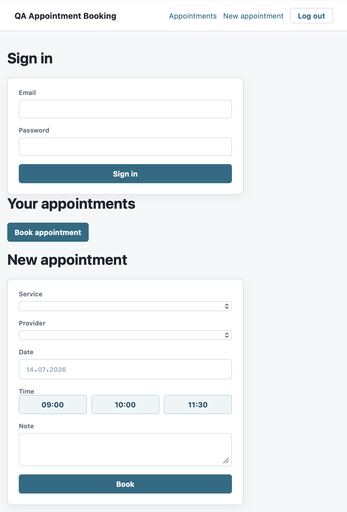
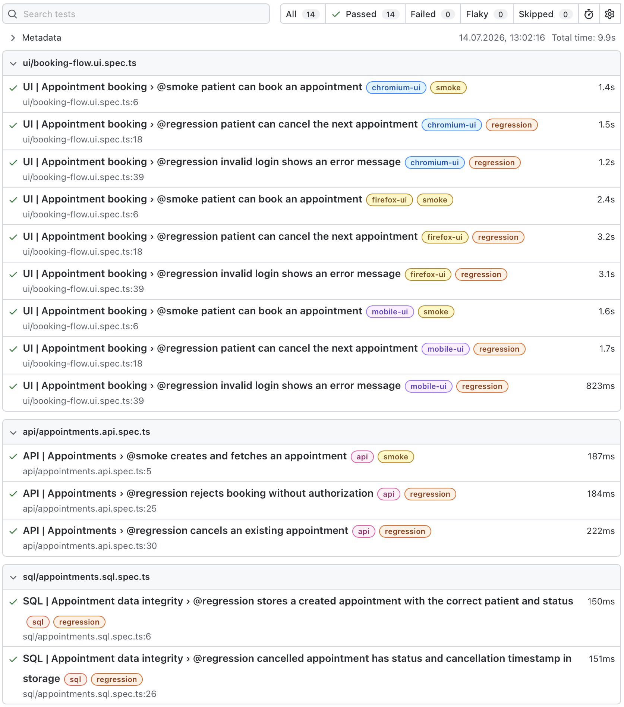

# Appointment Booking QA

Comprehensive test automation project for a web-based appointment booking application.

## Scope

- E2E UI in Playwright with Page Object Model
- API tests via `APIRequestContext`
- SQL tests for data integrity in PostgreSQL
- Test data, helpers, and configuration via environment variables
- HTML, JUnit report, screenshots, traces, and error videos
- GitHub Actions for smoke, UI, API, and SQL regression
---

---
## Start

```bash
npm install
npx playwright install --with-deps
cp .env.example .env
```

## Local Demo Application

The repository includes a simple demo application so you can run tests without a separate project.

In first terminal:

```bash
npm run dev
```

The application will be available at `http://127.0.0.1:3000`, and the API at `http://127.0.0.1:3000/api`.

In second terminal

```bash
npm test
```

## Most important commands

```bash
npm run test:smoke
npm run test:ui
npm run test:api
npm run test:sql
npm run report
```

## Required application selectors

UI tests use stable `data-testid` attributes, e.g.:

- `email-input`, `password-input`, `login-submit`
- `service-select`, `provider-select`, `date-input`, `time-slot`, `booking-submit`
- `booking-confirmation`, `appointment-card`, `cancel-appointment`

If the application has different selectors, it is best to change them only in the `src/pages` files.

## Environmental variables

Copy `.env.example` to `.env` and set:

- `BASE_URL` - web application address
- `API_URL` - API address
- `QA_PATIENT_EMAIL`, `QA_PATIENT_PASSWORD` - patient account
- `QA_ADMIN_EMAIL`, `QA_ADMIN_PASSWORD` - admin account
- `DB_*` - PostgreSQL connection data
- `DB_PROVIDER` - set `demo` for a local demo application or `postgres` for a real database.

## Structure

```text
src/
  config/       environment configuration
  fixtures/     extended Playwright fixture
  helpers/      API & DB clients and test data
  pages/        Page Object Model
tests/
  api/          API scenarios
  sql/          DB validation
  ui/           E2E scenarios
```
